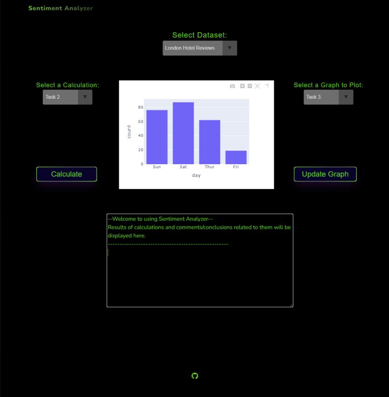

# Sentiment Analyzer
Web application for analyzing business reviews.

## 1.) How to setup & run
Clone the repository to your local machine.\
Install dependencies with:
```sh
pip install -r requirements.txt
```
Run the `main.py` file via commandline:
```sh
python main.py
```
You should see something like:
```sh
 * Serving Flask app 'main'
 * Debug mode: on
WARNING: This is a development server. Do not use it in a production deployment. Use a production WSGI server instead.
 * Running on http://127.0.0.1:5000
Press CTRL+C to quit
 * Restarting with stat
 * Debugger is active!
 * Debugger PIN: 115-732-936
```
Navigate to the address the flask application is running on via a web browser. In the above case, navigate to address: `http://127.0.0.1:5000`

## 2.) How to use
If you managed to do section 1.) without any issues, you should see a web page like this (size of your monitor and the web browser used might affect the aesthetics):\

\
\
There are three selection menus with a descriptive header above each one. They can be used to choose the desired dataset to analyse, choose the calculations to perform on the dataset, and to choose a datagraph associated with the dataset to plot.\
### 2.1) Performing calculations on the selected dataset
Once you have chosen the desired dataset to analyze and the calculation you want to perform, click the `Calculate` button. This will start the calculations, and will print the results to the textarea (There's a bug that can be seen if you choose to click the `Calculate`-button consecutively too fast. So hold your horses and don't click it until the text has finished printing onto the textarea).
### 2.2) Plotting a selected graph on the selected dataset
Once you have chosen the desired dataset to analyze and the graph you wish to plot, click the `Update Graph` button. This will perform any calculations needed to construct the selected graph, and will update the graph seen in the middle of the user interface with the chosen graph to plot.
